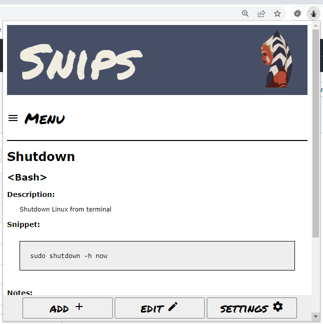

    

<h3 align="center">Snips</h3>

  <a href="../../issues">Report an Issue</a>
  ·
  <a href="../../releases">Releases</a>
  ·
  <a href="/CHANGELOG.md">Change Log</a>

  <a href="#Description">Description</a>
  ·
  <a href="#Roadmap">Roadmap</a>

## Description
A Chrome extension to help save handy code snippets. 

    

 

This is meant to be installed as a Chrome extension, so will look a little bulky if viewed as a web page.  

Allows a user to add and categorise handy code snippets for when you just can't remember how to get the local IP address on a Linux terminal...
